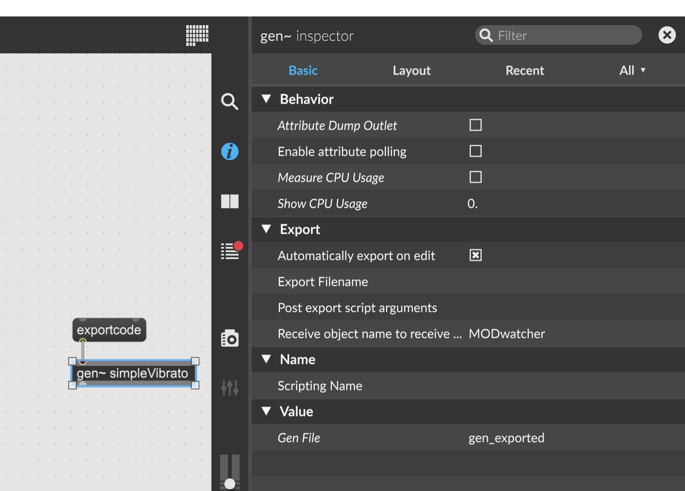
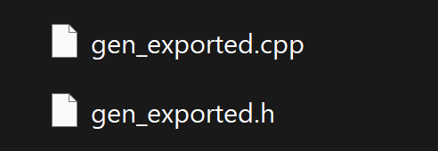

# modgen
## A plugin builder for gen~ & rnbo~ files for the mod.audio device ecosystem

---
### Instructions
- Install docker for your environment (https://www.docker.com/)
- Clone this repository: `git clone https://github.com/christosku/modgen.git`
- Copy `.env.example` to `.env`
- Modify `.env` according to your needs. By default it will boostrap both **modduox** and **moddwarf** but you can disable whichever you don't need. You can also change the exposed port to something else
- Run `docker compose up -d modgen`. It will take some time the first time you run it, but should be almost instantaneous from then on
- Once it's up and running, visit http://127.0.0.1:5000 in your browser.

### Usage
#### Prepare a gen~ export for uploading:
- In max, add an `exportcode` message to your gen~
- Change the **Gen File** value to `gen_exported`

- Click the `exportcode` and select a directory to save the files
- Two files should have been created, `gen_exported.cpp` and `gen_exported.h`

- Visit http://127.0.0.1:5000 in your browser and select these two files. Fill in the rest of the plugin info (name, brand, category, uri), select the device you want to build for and fill in the ip (the default ip for a device connected via USB is 192.168.51.1)
- If you want the options to be saved so that you don't have to fill them in each time, tick the **Save settings as default** checkbox.
- Press **Upload** and Daumen drücken (fingers crossed)!

#### Prepare an rnbo~ export for uploading:
- In max, open the rnbo~ patch, then the **export sidebar** and select the _C++ Source Code Export_
- Select a folder to export in and change the **Export Name** value to `rnbo_source.cpp`
- Click the _Export to Selected Target_
- A few files should have been created, you need `rnbo_source.cpp` and `description.json`
- Visit http://127.0.0.1:5000 in your browser and select these two files. Fill in the rest of the plugin info (name, brand, category, uri), select the device you want to build for and fill in the ip (the default ip for a device connected via USB is 192.168.51.1)
- Press **Upload** and Daumen drücken (fingers crossed)!